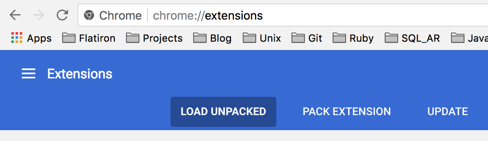
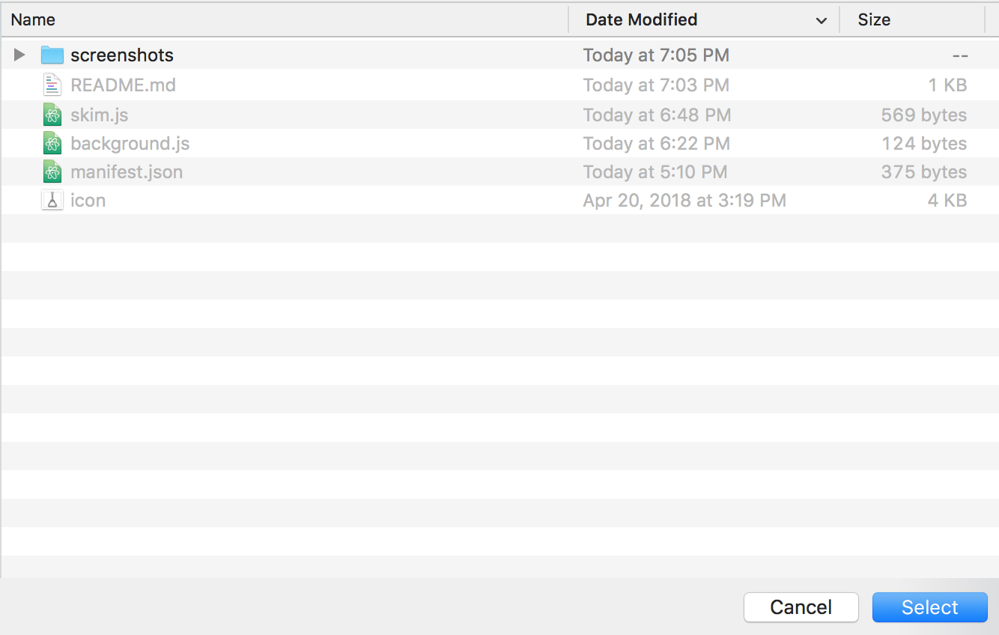
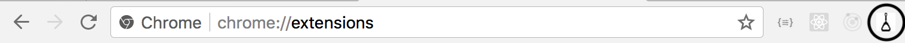

# StrapHanger
Because if you don't skim some of these articles, that mag is gonna start piling up in your house.  The extension highlights the first and last sentence of each paragraph of a New Yorker article for you, so you can skim it like a real New Yorker!

### Getting Started
Fork and clone the repo, then navigate to chrome://extensions to Load Unpacked Extension:

Select the folder containing the local repo:

Then navigate to any article on www.newyorker.com.  If it's too long, click the StrapHanger extension to skim it like a real New Yorker!

## License
Copyright 2018 Shahin Motia

Permission is hereby granted, free of charge, to any person obtaining a copy of this software and associated documentation files (the "Software"), to deal in the Software without restriction, including without limitation the rights to use, copy, modify, merge, publish, distribute, sublicense, and/or sell copies of the Software, and to permit persons to whom the Software is furnished to do so, subject to the following conditions:

The above copyright notice and this permission notice shall be included in all copies or substantial portions of the Software.

THE SOFTWARE IS PROVIDED "AS IS", WITHOUT WARRANTY OF ANY KIND, EXPRESS OR IMPLIED, INCLUDING BUT NOT LIMITED TO THE WARRANTIES OF MERCHANTABILITY, FITNESS FOR A PARTICULAR PURPOSE AND NONINFRINGEMENT. IN NO EVENT SHALL THE AUTHORS OR COPYRIGHT HOLDERS BE LIABLE FOR ANY CLAIM, DAMAGES OR OTHER LIABILITY, WHETHER IN AN ACTION OF CONTRACT, TORT OR OTHERWISE, ARISING FROM, OUT OF OR IN CONNECTION WITH THE SOFTWARE OR THE USE OR OTHER DEALINGS IN THE SOFTWARE.
